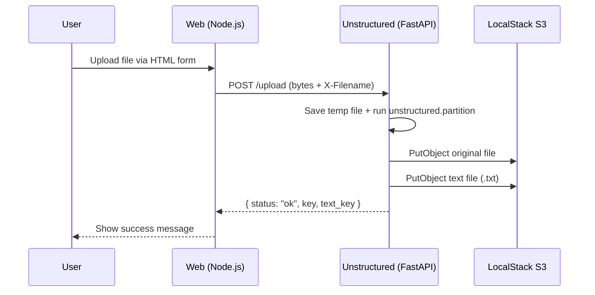
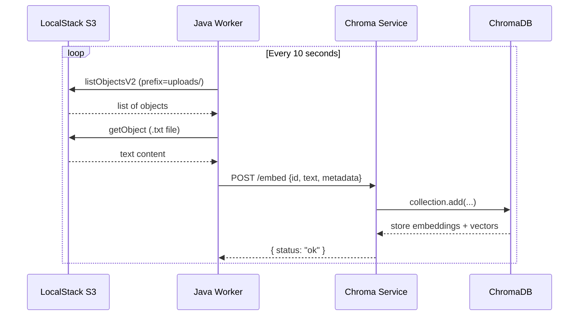
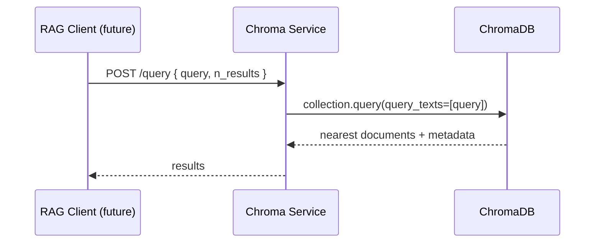
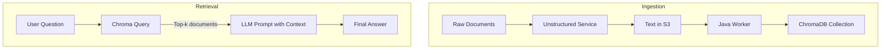

# 🔄 Data Flow & RAG Pipeline

This doc walks through **how data moves** through the system.

---

## 1️⃣ Upload & Extraction

**Important Ideas**

- The web app never touches S3 directly.
- The Unstructured service is the **single source of truth** for document ingestion.

---

## 2️⃣ S3 Polling & Embedding

**Important Ideas**

- The worker is **pull-based**, not push-based.
- Chroma is used as a **vector store**; it handles embeddings and similarity search.

---

## 3️⃣ Query Path (RAG Read Side)

In a full RAG application, the **Client** is often:

- A backend service that also calls an LLM (e.g., GPT, Claude, Llama)
- A chatbot that:
  1. Queries Chroma for relevant docs
  2. Feeds them into the LLM prompt as context
  3. Returns a grounded answer to the user

---

## 🧠 RAG Conceptual Diagram

Key teaching points for a new learner:

- **Ingestion path** (write side) prepares data.
- **Retrieval path** (read side) pulls relevant context at query time.
- RAG is all about **combining your data + an LLM**.
